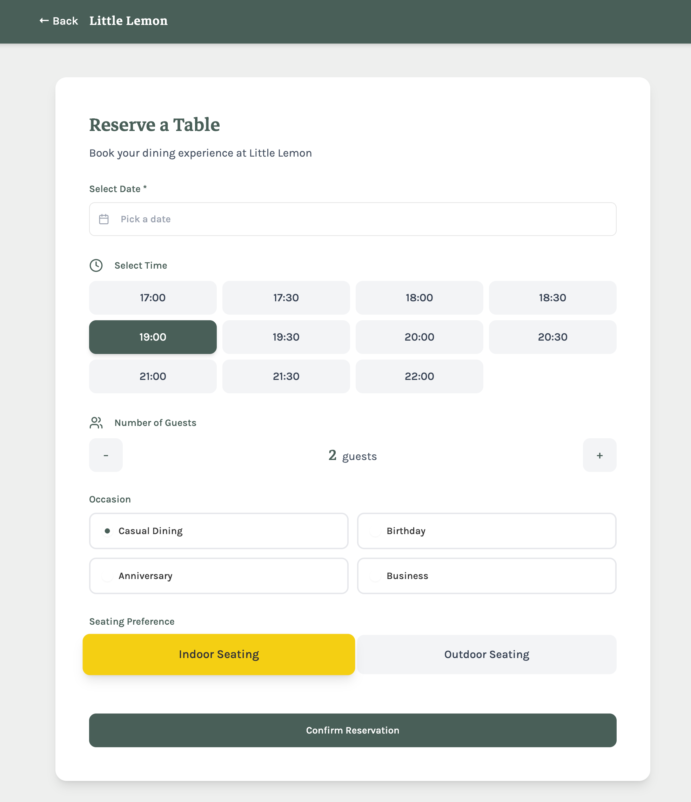

# Little Lemon Restaurant - Booking App

This project is a table booking web application for the Little Lemon restaurant, built with React and Vite. It allows users to reserve a table by selecting a date, time, number of guests, occasion, and seating preference.

**[View Live Demo](https://lassestilvang.github.io/littlelemon/)**

## Project Overview

This prototype demonstrates core frontend development skills including:
-   **Component-Based Architecture**: Modular React components for scalability.
-   **Interactive Forms**: Controlled inputs with validation and state management.
-   **Responsive Design**: A mobile-friendly interface adapted for various screen sizes using Tailwind CSS.
-   **Accessibility**: Semantic HTML and ARIA labels for screen reader support.



## Technologies Used

-   **React**: UI Library
-   **TypeScript**: Type safety
-   **Vite**: Build tool and development server
-   **Tailwind CSS**: Utility-first styling
-   **Radix UI**: Primitive accessible UI components
-   **Lucide React**: Icons
-   **Date-fns**: Date manipulation

## Getting Started

### Prerequisites

-   Node.js (v18 or higher recommended)
-   npm or yarn

### Installation

1.  Clone the repository:
    ```bash
    git clone https://github.com/lassestilvang/littlelemon.git
    cd littlelemon
    ```

2.  Install dependencies:
    ```bash
    npm install
    ```

3.  Start the development server:
    ```bash
    npm run dev
    ```

4.  Open your browser and navigate to `http://localhost:5173`.

## Testing

The project includes unit tests using Jest and React Testing Library.

Run the tests with:

```bash
npm test
```